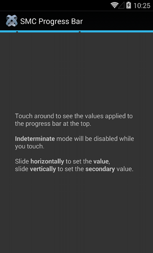
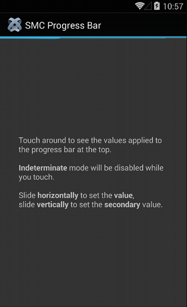

#TiAlternativeProgressBar Module

## Description
---------------

Drop-in replacement for `Ti.UI.ProgressBar`.

This module, compatible only with Android, includes the possibility to enable :

- **indeterminate mode** 
 
- **secondary progress**

----------------------




## Accessing the TiAlternativeProgressBar Module
----------------
To access this module from JavaScript, you would do the following:

	var AlternativeProgressBar = require('it.smc.alternativeprogressbar');

The AlternativeProgressBar is a reference to the Module object.

## Usage
--------

###Properties

- ``min :``	 *number*,	minimum value of the progress bar.
- ``max :``	 *number*,	maximum value of the progress bar.
- ``value :``	 *number*, 	main progress line value.
- ``secondary :``	 *number*,	sub-progress line value.
- ``indeterminate :``	 *boolean*,	set to false (default) to show an actual progress.

If you want to understand what `secondary` actually means or if you want to see it in action,
in `example/app.js` you’ll find a complete example. The following one only acts as a reference.

```js
var AlternativeProgressBar = require('it.smc.alternativeprogressbar');

var progressbar = AlternativeProgressBar.createProgressBar({
	top: '-26dip',
    min: 0,
    max: 100,
    value: 42,
    secondary: 49,
    indeterminate: true 
});
```	
###Please pay attention :


In this first release, to make the *Progress Bar* stick to the *Action Bar*, we set the **" top "** property to a magic number in dip, which is **" -26 "** .

## Author
------

Humbly made by the spry ladies and gents at SMC.

## License
------
This library, *TiAlternativeProgressBar*, is free software ("Licensed Software"); you can
redistribute it and/or modify it under the terms of the [GNU Lesser General
Public License](http://www.gnu.org/licenses/lgpl-2.1.html) as published by the
Free Software Foundation; either version 2.1 of the License, or (at your
option) any later version.

This library is distributed in the hope that it will be useful, but WITHOUT ANY
WARRANTY; including but not limited to, the implied warranty of MERCHANTABILITY,
NONINFRINGEMENT, or FITNESS FOR A PARTICULAR PURPOSE. See the GNU Lesser General
Public License for more details.

You should have received a copy of the [GNU Lesser General Public
License](http://www.gnu.org/licenses/lgpl-2.1.html) along with this library; if
not, write to the Free Software Foundation, Inc., 51 Franklin Street, Fifth
Floor, Boston, MA 02110-1301 USA
